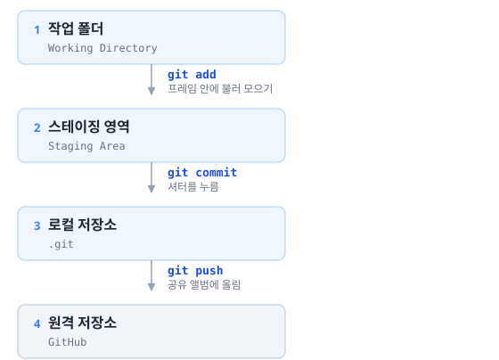
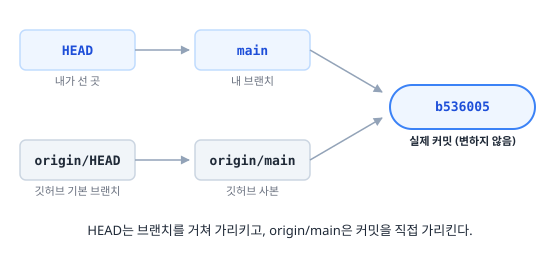
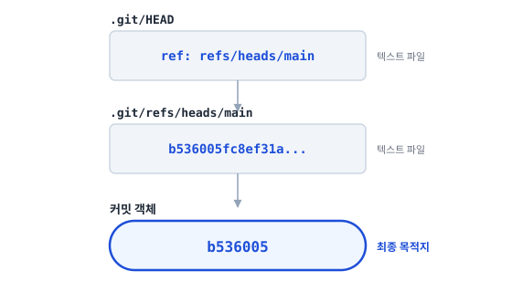
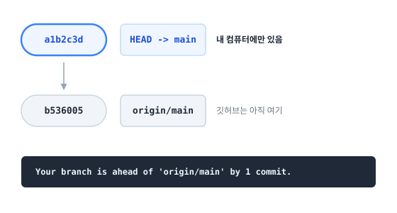

블로그를 만들면서 `git add` → `git commit` → `git push`를 기계적으로 따라 치고는 있었는데, 정작 **각 단계가 무엇을 하는지, 로그에 찍히는 `HEAD -> main, origin/main`이 무슨 뜻인지**는 모르고 있었다. 한 번 제대로 정리해 둔다.

---

## 1. Git은 3단계 구조다

가장 먼저 잡아야 할 그림. 내가 고친 파일이 깃허브까지 가는 길에는 **세 개의 방**이 있다.



**사진 찍기**에 빗대면 이렇다.

| 단계 | 명령 | 사진으로 치면 |
| --- | --- | --- |
| 작업 폴더 | — | 사람들이 여기저기 흩어져 있는 상태 |
| → 스테이징 | `git add` | "찍을 사람 이쪽으로" 프레임 안에 불러 모으기 |
| → 로컬 저장소 | `git commit` | 셔터를 누름. 그 순간이 사진으로 박제됨 |
| → 원격 저장소 | `git push` | 공유 앨범에 올려 다른 사람도 보게 함 |

이 비유가 잘 맞는 이유가 있다. Git이 스스로를 설명할 때 쓰는 단어가 바로 **스냅샷**이다.

- 프레임에 **누구를 넣을지 고르는 행위**가 곧 스테이징이다
- 프레임 밖에 서 있던 사람은 사진에 안 나오지만 **사라지지도 않는다** → `add` 안 한 파일과 같다
- **한 번 찍힌 사진은 고쳐지지 않는다** → 커밋은 변하지 않는다

**왜 `add`와 `commit`이 나뉘어 있을까?** 고친 파일이 10개인데 그중 6개만 하나의 작업 단위라면, 그 6개만 골라 담을 수 있어야 하기 때문이다. 단체사진을 찍을 때 아무나 다 프레임에 넣지 않는 것과 같다. 이 "고르는 단계"가 스테이징이다.

---

## 2. 기본 흐름

```bash
git status                    # ① 뭐가 바뀌었나 확인
git add .                     # ② 전부 담기
git status                    # ③ 담긴 게 맞나 다시 확인  ← 중요
git commit -m "메시지"         # ④ 확정
git push origin main          # ⑤ 깃허브로 전송
```

`git add .`의 `.`은 **"현재 폴더 아래 바뀐 것 전부"** 라는 뜻이다. 새로 만든 파일도 함께 잡힌다.

③번을 굳이 한 번 더 하는 이유는 뒤에서 설명한다.

---

## 3. `git status` 읽는 법

가장 자주 보게 될 화면이다. 깨끗한 상태는 이렇다.

```
On branch main
Your branch is up to date with 'origin/main'.

nothing to commit, working tree clean
```

| 줄 | 의미 |
| --- | --- |
| `On branch main` | 지금 `main` 브랜치에 있음 |
| `up to date with 'origin/main'` | 깃허브와 완전히 같음 |
| `working tree clean` | 고친 파일 없음 |

파일을 고치면 이렇게 바뀐다.

```
Changes to be committed:        ← git add 를 마친 것 (초록색)
        modified:   src/pages/index.astro

Changes not staged for commit:  ← 고쳤지만 아직 add 안 한 것 (빨간색)
        modified:   src/styles/global.css

Untracked files:                ← git 이 아직 모르는 새 파일
        src/components/Search.astro
```

**`Changes to be committed`에 있는 것만 커밋된다.** 프레임 안에 들어온 사람만 사진에 찍히는 것과 같다. 나머지 둘은 그대로 남는다.

파일 상태는 `git status -s`로 짧게 볼 수도 있다.

| 기호 | 뜻 |
| --- | --- |
| `M` | Modified — 기존 파일을 고침 |
| `A` | Added — 새 파일을 add 함 |
| `D` | Deleted — 삭제함 |
| `??` | Untracked — git이 모르는 새 파일 |

---

## 4. 이름표들 — HEAD, main, origin/main

로그를 보면 첫 줄에 괄호가 붙어 있다.

```
* b536005 (HEAD -> main, origin/main, origin/HEAD) feat: add client-side search
```

처음엔 이게 뭔지 전혀 몰랐는데, **전부 "커밋을 가리키는 이름표"** 였다. 가리키는 주체만 다르다.



### 커밋 `b536005`

실제 내용물이다. 찍힌 사진 그 자체라서 **한 번 만들어지면 변하지 않는다.** 나머지는 전부 이걸 가리키는 이름표일 뿐이다.

### `main` — 내 컴퓨터의 브랜치

작업 줄기의 이름이다. **커밋할 때마다 자동으로 앞으로 따라온다.**

```
커밋 전:   ● bf7e006  ← main
커밋 후:   ● bf7e006
           ● a1b2c3d  ← main   (자동으로 이동)
```

`main`이라는 이름 자체에 특별한 의미는 없다. 관습적인 기본 줄기 이름이다(예전엔 `master`였다).

### `HEAD` — 지금 내가 서 있는 곳

**"지금 어느 브랜치에서 작업 중인가"** 를 가리킨다. 놀랍게도 실체는 텍스트 파일 한 줄이다.

```bash
cat .git/HEAD
```
```
ref: refs/heads/main
```

HEAD는 커밋을 직접 가리키지 않고 **브랜치를 가리킨다.** 사슬을 끝까지 따라가면 이렇다.



그래서 로그에 화살표가 붙는다.

```
HEAD -> main     "HEAD가 main을 가리키고, main이 b536005를 가리킨다"
origin/main      화살표 없음 = 커밋을 직접 가리킴
```

브랜치를 바꿀 때 Git이 순식간에 처리하는 이유도 여기 있다. **`.git/HEAD`의 저 한 줄을 고치는 게 전부**이기 때문이다.

> `.git` 폴더 안은 구경해도 되지만 **직접 수정하면 안 된다.** 망가지면 이력이 통째로 깨진다.

### `origin` — 깃허브 주소의 별명

```bash
git remote -v
```
```
origin  https://github.com/gksdydwn/gksdydwn.github.io.git
```

매번 긴 주소를 칠 수 없으니 붙여둔 짧은 별명이다. `git push origin main`의 그 `origin`이다.

### `origin/main` — 깃허브의 main이 어디였는지, **내 컴퓨터에 저장된 사본**

여기가 제일 헷갈렸던 부분이다. **`origin/main`은 깃허브를 실시간으로 보고 있는 게 아니다.**

> "내가 **마지막으로 깃허브와 통신했을 때**, 저쪽 main은 여기였다"

는 기록이 내 컴퓨터에 저장돼 있는 것이다. 갱신되는 시점은 `push` / `fetch` / `pull` 할 때뿐이다.

커밋만 하고 푸시하지 않으면 둘이 갈라진다.



푸시하면 `origin/main`이 따라 올라와 다시 한 줄에 모인다.

> 반대로 **다른 컴퓨터에서 깃허브에 푸시했다면 내 `origin/main`은 그 사실을 모른다.** `git fetch`나 `git pull`을 해야 알게 된다. 작업 시작 전에 `git pull` 하는 습관이 필요한 이유다.

### `origin/HEAD` — 깃허브 저장소의 기본 브랜치

저장소 페이지를 열었을 때 처음 보이는 브랜치가 뭔지 기록해 둔 것이다. `git clone`이 어느 브랜치를 꺼내 놓을지 정할 때 쓴다. **실무에서 신경 쓸 일은 거의 없다.**

### 정리

| 이름표 | 정체 | 언제 움직이나 |
| --- | --- | --- |
| `main` | 내 컴퓨터의 브랜치 | 커밋할 때 |
| `HEAD` | 지금 서 있는 곳 | 브랜치를 바꿀 때 |
| `origin` | 깃허브 주소의 별명 | 안 움직임 |
| `origin/main` | 깃허브 main의 **로컬 사본** | push / fetch / pull 할 때 |
| `origin/HEAD` | 깃허브의 기본 브랜치 표시 | 거의 안 움직임 |

**셋(`HEAD`, `main`, `origin/main`)이 한 줄에 모여 있으면 로컬과 깃허브가 완전히 같은 상태**다.

---

## 5. 커밋 메시지 규칙

**Conventional Commits**라는 널리 쓰이는 형식을 따르기로 했다.

```
<타입>: <무엇을 했는지>
```

| 타입 | 쓰는 경우 |
| --- | --- |
| `feat` | 새 기능 추가 |
| `fix` | 버그 수정 |
| `docs` | 문서만 수정 |
| `refactor` | 동작은 그대로, 코드 구조만 개선 |
| `style` | 공백·세미콜론 등 동작과 무관한 변경 |
| `chore` | 빌드 설정, 잡일 |

핵심은 **명령형 현재시제**로 쓰는 것. `added`(과거형)나 `adding`(진행형)이 아니라 `add`다.

```
✅ feat: add client-side search in the header
✅ fix: strip leading hash from search terms

❌ feat: added search        (과거형)
❌ update files              (뭘 했는지 알 수 없음)
❌ 수정                       (한 달 뒤의 내가 원망함)
```

커밋 메시지는 **미래의 나에게 보내는 쪽지**다. 나중에 "이 코드 왜 이렇게 됐지?" 할 때 읽게 되는 게 이것뿐이다.

---

## 6. 커밋은 논리 단위로 쪼갠다

파일 전부를 한 번에 올리는 대신, 성격이 다른 작업은 나눠 담을 수 있다. 단체사진 한 장에 다 넣지 않고 팀별로 나눠 찍는 셈이다.

```bash
# 커밋 ① 분류 체계
git add src/content.config.ts src/components/CategoryTree.astro
git commit -m "feat: separate category from tags with a two-level tree"

# 커밋 ② 검색 기능
git add src/components/Search.astro src/components/Header.astro
git commit -m "feat: add client-side search in the header"
```

이렇게 해두면 나중에 **"검색 기능만 되돌리고 싶다"** 같은 일이 쉬워진다.

다만 개인 블로그에서는 그럴 일이 드물어서, 평소엔 `git add .`로 한 번에 담아도 충분하다. **쪼개는 건 "나중에 따로 되돌릴 것 같은가"를 기준으로** 판단하면 된다.

---

## 7. 함정 — `git commit -am`

`add`와 `commit`을 한 번에 하는 옵션이 있다.

```bash
git commit -am "메시지"     # add + commit 한 번에
```

편해 보이지만 **함정이 있다.** `-a`는 **git이 이미 알고 있는 파일**만 담는다.

```
 M  src/components/Header.astro     ← -a 로 담김 ✅
 ??  src/components/Search.astro    ← 새 파일이라 조용히 빠짐 ❌
```

새로 만든 파일이 있으면 **아무 경고 없이 누락된다.** 처음 온 사람은 "찍을 사람 모여라" 소리를 못 들어서 프레임 밖에 그대로 서 있는 셈이다. 이러면 "내 컴퓨터에선 되는데 배포하면 안 돼요"가 된다.

실제로 이번에 검색 기능을 만들면서 `Search.astro`가 새 파일이었기 때문에, `-am`을 썼다면 기능이 통째로 빠질 뻔했다.

**새 파일이 있을 땐 반드시 `git add .`를 쓴다.**

---

## 8. 되돌리기

| 상황 | 명령 |
| --- | --- |
| `add`한 걸 취소 (수정 내용은 유지) | `git restore --staged <파일>` |
| 파일 수정을 통째로 버리기 ⚠️ | `git restore <파일>` |
| 방금 커밋 메시지만 고치기 | `git commit --amend -m "새 메시지"` |
| 방금 커밋 취소 (수정 내용은 유지) | `git reset --soft HEAD~1` |

> ⚠️ `git restore <파일>`은 **고친 내용이 사라진다.** 커밋 전이면 복구 방법이 없다. `--staged`가 붙으면 프레임에서 빼는 것뿐이라 안전하다.
>
> 그리고 `--amend`와 `reset`은 **이미 푸시한 커밋에는 쓰지 않는다.** 깃허브와 이력이 어긋나서 다음 푸시가 거부된다.

---

## 9. 매번 길게 치지 않는 방법

파일 경로를 하나하나 나열하는 건 금방 지친다. 상황별로 이렇게 정리했다.

### 평소 — `git add .`

```bash
git add .
git commit -m "메시지"
git push origin main
```

### 눈으로 보면서 — VS Code

`Ctrl + Shift + G`로 Source Control 패널을 연다.

```
CHANGES (8)
  ⊕  CategoryTree.astro      M      ← ⊕ 로 이 파일만 담기
  ⊕  Search.astro            U      ← U = 새 파일
┌──────────────────────────┐
│ 커밋 메시지 입력           │
└──────────────────────────┘
        [ ✓ Commit ]
```

파일 이름을 클릭하면 **바뀐 부분이 좌우로 나란히** 보인다. `git diff`보다 훨씬 읽기 쉽고, 커밋 쪼개기도 마우스로 된다. 타이핑은 커밋 메시지뿐이다.

### 글만 썼을 때 — 옵시디언 Git 플러그인

`Obsidian Git: Commit and push all changes`에 단축키를 걸어두면, 글 쓰고 그 키만 눌러 add·commit·push가 한 번에 끝난다. 터미널을 열 필요조차 없다.

### 경로는 Tab 키로

```
git add src/com<Tab>           →  git add src/components/
git add src/components/Se<Tab> →  git add src/components/Search.astro
```

---

## 10. alias 등록하기

자주 쓰는 명령을 짧게 줄여둘 수 있다. 두 개만 등록했다.

```bash
git config --global alias.st status
git config --global alias.lg "log --oneline --graph --decorate -20"
```

```bash
git st      # = git status
git lg      # 최근 20개 커밋을 그래프로
```

`--global`이라 `~/.gitconfig`에 저장되고 **모든 프로젝트에서** 쓰인다.

```
* b536005 (HEAD -> main, origin/main) feat: add client-side search in the header
* bf7e006 feat: separate category from tags with a two-level tree
* 8eb0dfe docs: add blog setup guide and handover history
```

### `add` + `commit`을 묶는 alias는 일부러 만들지 않았다

```bash
git cm "메시지"   # = git add . + git commit -m   ← 만들지 않음
```

편하지만 **`git add` 후 `git status`로 확인하는 그 순간이 안전장치**이기 때문이다. 셔터를 누르기 전에 뷰파인더를 한 번 보는 것과 같다. 묶어버리면

- 실수로 고친 파일이 딸려 들어가도 모르고
- 디버깅용 `console.log`나 임시 파일이 그대로 커밋되고
- API 키가 든 파일이 섞이면 **푸시 후엔 이력에 영구히 남는다**

손에 익어서 `git status` 결과가 한눈에 들어오게 되면 그때 다시 판단하기로 했다.

### 참고: `--decorate`를 명시한 이유

Git은 결과가 **터미널 화면으로 바로 나갈 때만** 이름표를 자동으로 붙인다. 출력이 파이프를 타면 조용히 꺼진다. 그래서 alias에는 `--decorate`를 명시적으로 넣어 어떤 상황에서도 나오게 했다.

---

## 마무리

정리하면서 가장 크게 남은 건 두 가지다.

**하나.** `add`와 `commit`이 나뉜 건 불편하라고 만든 게 아니라 **"무엇을 담을지 고르고 확인하는 단계"** 였다. 프레임에 누구를 넣을지 정하는 일이 곧 스테이징이고, `git status`를 한 번 더 보는 습관이 여기서 나온다.

**둘.** `HEAD`, `main`, `origin/main`은 전부 **커밋을 가리키는 이름표**일 뿐이고, 커밋 자체는 절대 변하지 않는다. 특히 `origin/main`이 실시간이 아니라 **마지막 통신 시점의 사본**이라는 걸 알고 나니, `git pull`을 왜 먼저 해야 하는지가 그제야 이해됐다.

다음엔 브랜치를 직접 만들어 보면서 그래프가 갈라지고 합쳐지는 걸 정리해 볼 생각이다.
